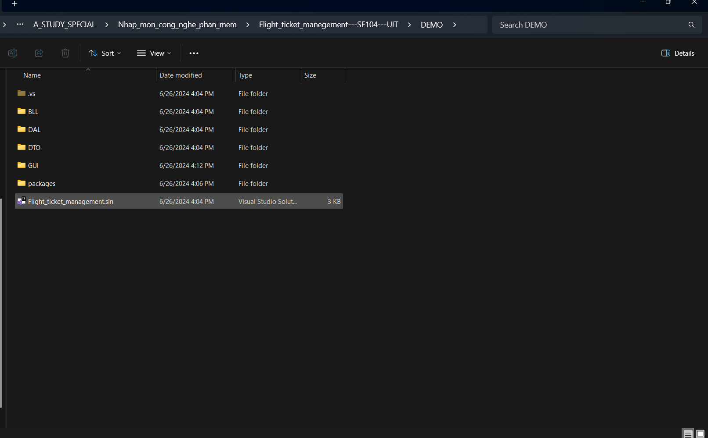
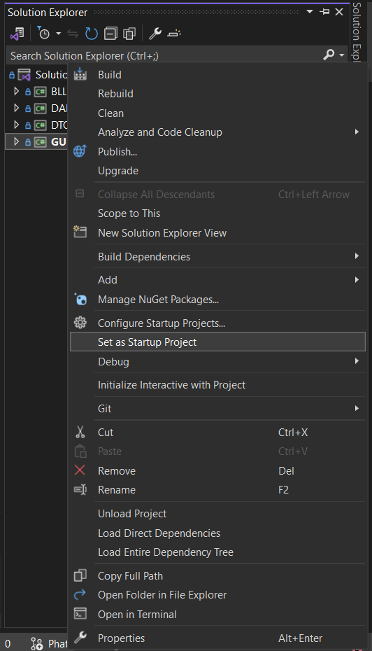
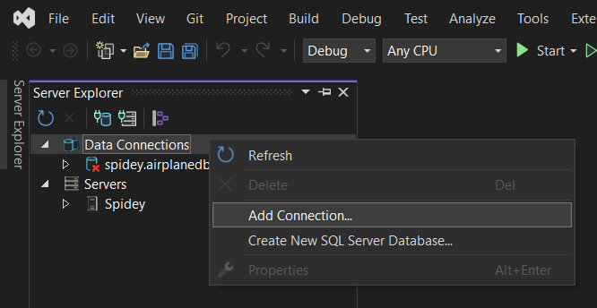
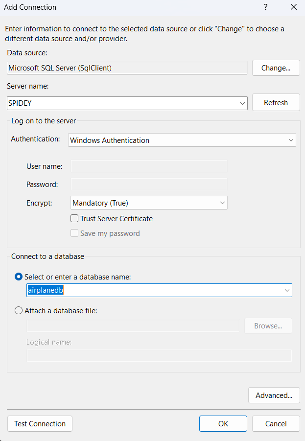
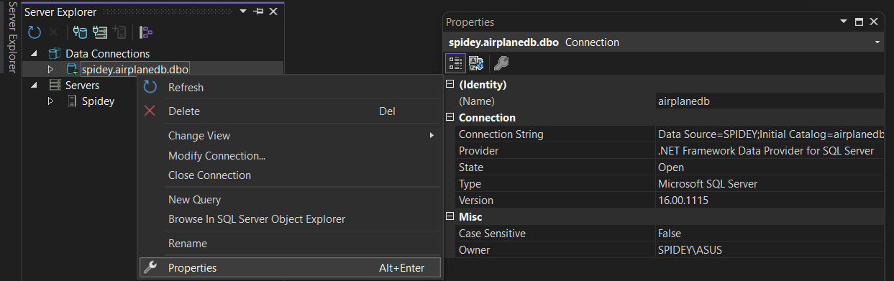
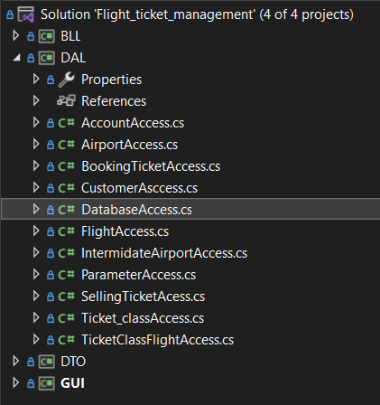
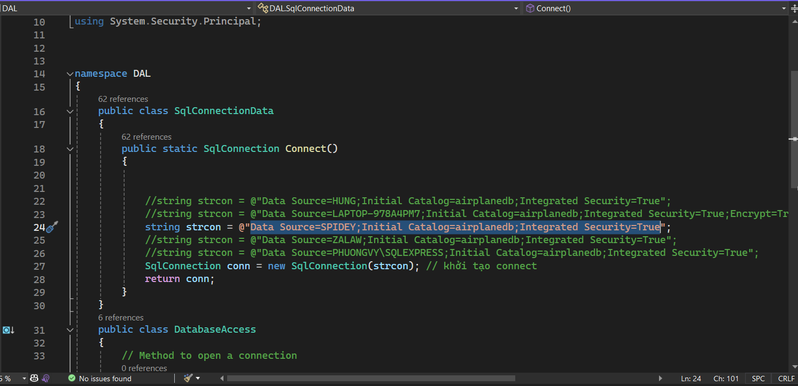

<!-- Banner -->

  

<h1 align="center"><b>NHẬP MÔN CÔNG NGHỆ PHẦN MỀM - SE104 </b></h1>

# Thành viên nhóm
| STT    | MSSV          | Họ và Tên              |Chức Vụ    | Github                                                  | Email                   |
| ------ |:-------------:| ----------------------:|----------:|--------------------------------------------------------:|-------------------------:
| 1      | 22521074      | Nguyễn Hùng Phát         |Nhóm trưởng|[phat9824](https://github.com/phat9824)  |22521074@gm.uit.edu.vn   |
| 2      | 22520506      | Lê Minh Hùng        |Thành viên |[LeMinhHung120204](https://github.com/LeMinhHung120204)            |22520506@gm.uit.edu.vn   |
| 3      | 22520830      | Văn Công Gia Luật        |Thành viên |[zalaw1610](https://github.com/zalaw1610)|22520830@gm.uit.edu.vn   |
| 4      | 22521189      | Thái Ngọc Quân            |Thành viên |[QuanThaiX](https://github.com/QuanThaiX)                    |22521189@gm.uit.edu.vn   |
| 5      | 225221708     | Trần Phương Vy       |Thành viên |[tranphuongVy](https://github.com/tranphuongVy)    |22521708@gm.uit.edu.vn   |

# GIỚI THIỆU MÔN HỌC
* **Tên môn học:** Nhập môn công nghệ phần mềm
* **Mã môn học:** SE104
* **Mã lớp:** SE104.O27
* **Năm học:** HK2 (2023 - 2024)
* **Giảng viên**: Đặng Việt Dũng

# ĐỒ ÁN CUỐI KÌ
* **Đề tài:** Phần mềm quản lý thư bán vé máy bay

# HƯỚNG DẪN CÀI ĐẶT
* Bước 1: Đầu tiên phải đảm bảo bạn đã cài đặt MySQL và C# .Net
* Bước 2: Khởi tạo database ở file scipt airplanedb trong folder DATABASE
* Bước 3: Chạy file app mở IDE lên

* Bước 4: Set Up cho GUI làm startup Project

* Bước 5: Vào View -> sever explorer ->  chuột trái DataConnections -> Add Connection

* Bước 6: Điền **Sever name** của MySQL và tên database đã tạo ở SQL

* Bước 7: vô Properties copy **Connection String**

* Bước 8: Mở file DatabaseAccess.cs và paste đường dẫn vừa copy vào biến strcon

<!-- Footer -->

Copyright © 2024 Nhóm 15 - SE104.O27

